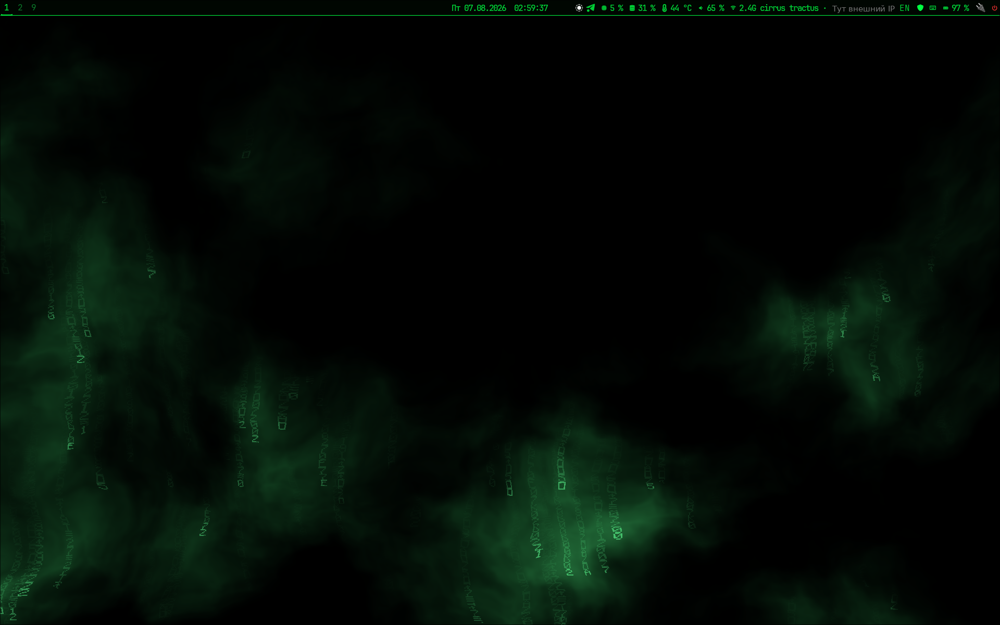

# hyprland_config

Конфиг рабочего окружения Hyprland

Ноутбук, Ubuntu 24.04, сессия «Hyprland (uwsm-managed)» из GDM, рядом остаётся GNOME как fallback.
Matrix-зелёная тема `#00ff41` на чёрном — композитор, панель, лончеры, меню и
живые GLSL-обои в одном стиле.



## Состав

- `hypr/` — конфиги композитора:
  - `hyprland.conf` — мониторы (3 выхода, воркспейсы по физическому порядку),
    автостарт через `uwsm app`, ввод, бинды **по кейкодам** (`code:NN` — работают
    при любой раскладке), правила окон, minimize в `special:minimized`;
  - `hypridle.conf`, `hyprlock.conf`, `hyprpaper.conf`, `matrix-wall.png`;
  - `shaders/` — GLSL-шейдеры живых обоев для glpaper (`smoke-green.frag` — основной).
- `waybar/` — `config.jsonc` + `style.css`: воркспейсы, глиф активного окна,
  часы с кастомной локалью, CPU/RAM/температура, звук, сеть (Wi-Fi диапазон +
  внешний IP из кэша), буфер обмена, раскладка, батарея/профили питания, питание.
- `fuzzel/`, `rofi/`, `wofi/` — лончеры приложений в единой matrix-теме
  (активно используется rofi + fuzzel; wofi оставлен как вариант).
- `bin/` — скрипты `~/.local/bin`:
  - `power-menu`, `powerprofile-menu` — меню питания и профилей/Boost на rofi;
  - `rofi-launch`, `rofi-menu`, `rofi-outside-close` — single-instance лончер и
    позиционированные трей-меню с закрытием по клику-мимо;
  - `menu-example` — **обезличенный пример** трей-меню (браузер/терминал/файлы/выход),
    шаблон для своих пунктов;
  - `net-status`, `net-menu`, `wifi-passwd-connect` — индикатор сети и диспетчер
    подключений поверх NetworkManager;
  - `shader-wall`, `shader-wall-hotplug` — toggle живых GLSL-обоев на всех выходах
    + автоподхват горячеподключённых мониторов (фейл-сейф на статичный hyprpaper);
  - `unminimize.sh` — возврат окон из `special:minimized` через fuzzel;
  - `hypr-kbtoggle` — глобально-синхронное переключение раскладки для всех клавиатур;
  - `layout-indicator`, `win-icon`, `ac-indicator`, `power-glyph` — модули waybar;
  - `hypr-cheatsheet` — шпаргалка хоткеев (SUPER+/);
  - `waybar-supervised` — супервизор панели с логом и авторестартом;
  - `sudo-askpass` — GUI-диалог пароля для `sudo -A` (zenity).
- `systemd-user/` — пример user-юнита демона под uwsm (`graphical-session.target`).
- `locale/` — кастомная локаль `ru_RU_nom` (именительный падеж месяца в часах waybar).
- `screenshot.png` — рабочий стол: живые обои `smoke-green.frag` + waybar.

## Установка (кратко)

```sh
cp -r hypr waybar fuzzel rofi wofi ~/.config/
cp bin/* ~/.local/bin/ && chmod +x ~/.local/bin/*
# локаль для часов waybar — по locale/README.md
```

Зависимости: `hyprland uwsm waybar rofi fuzzel hypridle hyprlock hyprpaper mako
glpaper grim slurp wl-clipboard cliphist brightnessctl playerctl jq socat zenity`,
шрифт JetBrainsMono Nerd Font, иконки Yaru.

Бинды — по физическим кейкодам: SUPER+Return/T — терминал, SUPER+D — rofi,
SUPER+Shift+D — fuzzel, SUPER+M/S — свернуть/вернуть окно, SUPER+Shift+B — живые
обои, SUPER+/ — шпаргалка. Полный список — `bin/hypr-cheatsheet` и комментарии
в `hypr/hyprland.conf`.

## Лицензия

Braxalend Personal Use License — свободно для личного использования, см. `LICENSE`.
